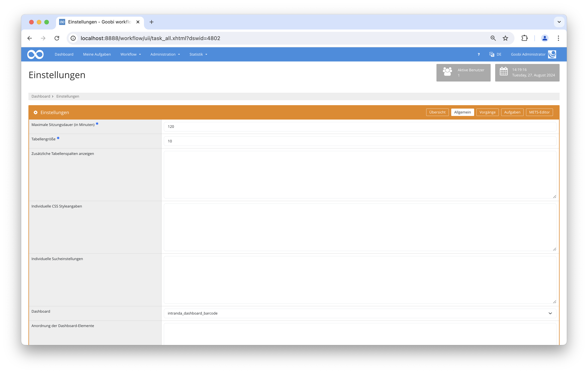

## Einführung
Dieses Dashboard-Plugin wurde entwickelt, um die Verwendung eines Barcode-Scanners in Goobi Workflow zu erleichtern. Es besteht aus zwei Teilen. Auf der linken Seite befindet sich eine Tabelle mit den zuletzt erledigten Aufgaben. Auf der rechten Seite befindet sich ein Formular für verschiedene Aktionen, wie z.B. das Annehmen und Abschließen von Aufgaben oder das Ändern von Standorten.

## Installation
Um das Plugin nutzen zu können, müssen folgende Dateien installiert werden:

```bash
/opt/digiverso/goobi/plugins/dashboard/plugin_intranda_dashboard_barcode.jar
/opt/digiverso/goobi/plugins/GUI/plugin_intranda_dashboard_barcode-GUI.jar
```

Um zu konfigurieren, wie sich das Plugin verhalten soll, können verschiedene Werte in der Konfigurationsdatei angepasst werden. Die Konfigurationsdatei befindet sich üblicherweise hier:

```bash
/opt/digiverso/goobi/config/plugin_intranda_dashboard_barcode.xml
```

Für eine Nutzung dieses Plugins muss der Nutzer innerhalb der Einstellungen für das Dashboard den Wert `intranda_dashboard_barcode` auswählen. 




## Überblick und Funktionsweise
Um dieses Dashboard-Plugin zu nutzen, muss man es zunächst über `Einstellungen -> Allgemein -> Dashboard` aktivieren und sich dann neu anmelden. Wenn das Plugin korrekt installiert und konfiguriert wurde, sollte es bereits unter dem Menüpunkt `Dashboard` aktiviert sein.


Auf der linken Seite befindet sich eine Tabelle mit den zuletzt erledigten Aufgaben. Sie können ihre Prozesse und Daten überprüfen und auch einige Aktionen durchführen.

Auf der rechten Seite befindet sich ein Formular mit verschiedenen Aktionen. Sie können eine auswählen, indem Sie darauf klicken. Wird die Aktion `Nur Ortsänderung` gewählt, gibt es ein zusätzliches Eingabefeld, das den Namen des neuen Orts erwartet. Für alle Aktionen gibt es ein obligatorisches Eingabefeld, in dem der Titel des Goobi-Prozesses erwartet wird. Dieses Feld wird nach dem Laden automatisch fokussiert, um die Verwendung eines Barcodescanners zu erleichtern. Durch Anklicken des Buttons `Ausführen` wird die gewählte Aktion ausgeführt, und es werden Meldungen über den Erfolg ausgegeben. Die durchgeführte Aktion sowie der Eingabeort werden zur Erleichterung weiterer Anwendungen gespeichert. Sie bleiben unverändert, bis eine manuelle Änderung vorgenommen wird.

## Konfiguration
Die Konfiguration des Plugins erfolgt in der Datei `plugin_intranda_dashboard_barcode.xml` wie hier aufgezeigt:

{{CONFIG_CONTENT}}

Die folgende Tabelle enthält eine Zusammenstellung der Parameter und ihrer Beschreibungen:

Parameter               | Erläuterung
------------------------|------------------------------------
| `tasks-latestChanges-size` | Dieser Parameter legt fest, wie viele erledigten Aufgaben in der linken Tabelle angezeigt werden sollen. |
| `show-accept-option` | Dieser Parameter legt fest, ob der Aktionsbutton für die Annahme neuer Aufgaben angeschaltet werden soll. DEFAULT false. |
| `show-finish-option` | Dieser Parameter legt fest, ob der Aktionsbutton für die Beendigung alter Aufgaben angeschaltet werden soll. DEFAULT false.|
| `show-accept-and-finish-option` | Dieser Parameter legt fest, ob der AktionsButton für die Annahme neuer Aufgaben und deren Beendigung angeschaltet werden soll. DEFAULT false. |
| `show-change-location-option` | Dieser Parameter legt fest, ob der AktionsButton für den Ortswechsel angeschaltet werden soll. DEFAULT false. |