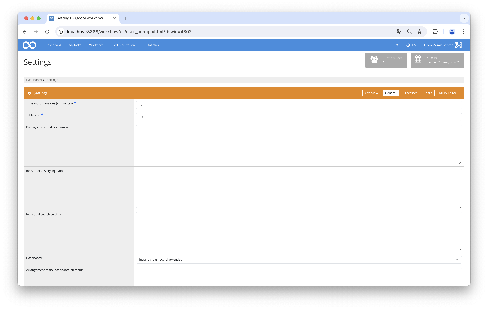
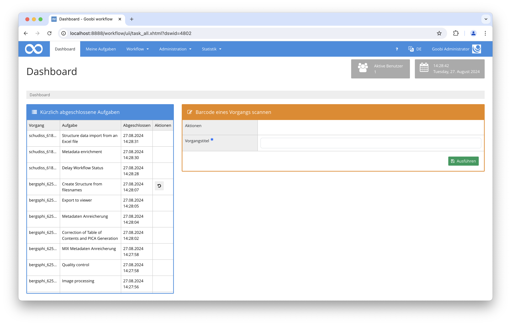

## Introduction
This dashboard plugin was developed to facilitate the use of a barcode scanner in the Goobi Workflow. It consists of two parts. On the left side, there is a table displaying the most recently completed tasks. On the right side, there is a form for various actions, such as accepting and completing tasks or changing locations.

## Installation
In order to use the plugin, the following files must be installed:

```bash
/opt/digiverso/goobi/plugins/dashboard/plugin_intranda_dashboard_barcode.jar
/opt/digiverso/goobi/plugins/GUI/plugin_intranda_dashboard_barcode-GUI.jar
```

To configure how the plugin should behave, various values in the configuration file can be adjusted. The configuration file is usually located here: 


```bash
/opt/digiverso/goobi/config/plugin_intranda_dashboard_barcode.xml
```

To use this plugin, the user must select the intranda_dashboard_barcode value within the dashboard settings.



## Overview and functionality
To use this dashboard plugin, you first need to activate it via `Settings -> General -> Dashboard` and then log in again. If the plugin is correctly installed and configured, it should already be activated under the `Dashboard` menu item.



On the left side, there is a table displaying the most recently completed tasks. You can review your processes and data and also perform some actions.

On the right side, there is a form with various actions. You can select one by clicking on it. If the action Change Location Only is chosen, an additional input field will appear, expecting the name of the new location. For all actions, there is a mandatory input field where the title of the Goobi process is expected. This field is automatically focused after loading to facilitate the use of a barcode scanner. By clicking the Execute button, the selected action will be performed, and messages regarding success will be displayed. The performed action and the input location are saved to facilitate further applications. They remain unchanged until a manual change is made.

## Configuration
The plugin is configured in the file `plugin_intranda_dashboard_barcode.xml` as shown here:

{{CONFIG_CONTENT}}

The following table contains a summary of the parameters and their descriptions:

Parameter               | Explanation
------------------------|------------------------------------
| `tasks-latestChanges-size`      | This parameter defines how many completed tasks should be displayed in the left table. |
| `show-accept-option`            | This parameter determines whether the action button for accepting new tasks should be enabled. DEFAULT false. |
| `show-finish-option`            | This parameter determines whether the action button for finishing old tasks should be enabled. DEFAULT false. |
| `show-accept-and-finish-option` | This parameter determines whether the action button for accepting new tasks and completing them should be enabled. DEFAULT false. |
| `show-change-location-option`   | This parameter determines whether the action button for changing location should be enabled. DEFAULT false. |